<div align="center">


<a href="https://github.com/yaswanth-kolachala">

</a>

<br/>

[](https://linkedin.com/in/yaswanth-kolachala)
[](mailto:yaswanthkolachala24@gmail.com)
[](https://github.com/yaswanth-kolachala)
[](https://github.com/yaswanth-kolachala)

</div>

<br/>

## 👋 About Me

```json
{
  "name": "Yaswanth Kolachala Venkata Sai Saketh",
  "role": "Senior Quality Engineer @ Cognizant Technology Solutions",
  "based_in": "Hyderabad, India",
  "years_experience": "~6",
  "leads": "5-member QA team across 6+ enterprise retail modules",
  "focus": ["Test Automation Frameworks", "UI & API Testing", "Release Quality Analytics"]
}
```

I design and scale UI and API test automation for enterprise retail applications — from framework architecture to release readiness reporting. Currently leading the migration of a legacy Selenium/BDD stack to Playwright, while mentoring engineers and driving the QA strategy for a multi-module retail platform end to end.

<br/>

## 🛠️ Tech Stack

<div align="center">

**Test Automation**
<br/>


**Build, CI/CD & Cloud**
<br/>


**Reporting & Defect Management**
<br/>


**IDEs**
<br/>


</div>

<br/>

## 💼 Professional Experience

**Senior Quality Engineer** · Cognizant Technology Solutions, Hyderabad, India
<br/>
*Aug 2020 – Present*

- Led end-to-end QA automation across **6+ enterprise retail modules**, achieving **80% automation coverage** and contributing to **90% defect-free production releases**.
- Served as primary QA point of contact, driving automation strategy and sprint planning to accelerate release cycles by **40%**.
- Led sprint planning, task prioritization, and resource allocation for a **5-member QA team**, improving Agile delivery and sprint velocity.
- Designed and maintained scalable UI and API automation frameworks using **Playwright (JavaScript)**, **Selenium (Java)**, and **REST Assured**.
- Optimized the Selenium framework, reducing regression execution time by **30%** while improving defect detection through proactive dev collaboration.
- Presented QA health metrics, execution reports, and defect analytics to clients and stakeholders, enabling data-driven release decisions.

<br/>

## 🏆 Notable Achievements

| Achievement | Impact |
|---|---|
| 🎯 UI automation strategy | Consistently **80%+ test stability**, peaking at **90%** |
| 🔁 Selenium BDD → Playwright migration | Improved execution speed, maintainability & scalability |
| 📦 Test suite consolidation | **2,000+ legacy cases** streamlined into **<300 high-value scenarios** |
| 🧩 Modular framework design | Reusable utilities improving stability & execution efficiency |
| 🧑‍🏫 Mentorship | Onboarded & upskilled QA engineers on Playwright & framework architecture |
| 📊 QA dashboard | Centralized release metrics, automation reports & defect trends in real time |

<br/>

## 🎓 Education

**Bachelor of Technology (B.Tech), Mechanical Engineering**
<br/>
Lovely Professional University, Punjab, India · Aug 2016 – May 2020

<br/>

## 📊 GitHub Stats

<div align="center">


</div>

<div align="center">

</div>

<sub>Generated daily by <code>update-stats.yml</code> using <a href="https://github.com/stats-organization/github-readme-stats-action">github-readme-stats-action</a> and <a href="https://github.com/DenverCoder1/github-readme-streak-stats">github-readme-streak-stats</a> — both run inside this repo's own GitHub Action and commit static SVGs, so there's no live third-party endpoint to depend on.</sub>

<br/>

<div align="center">

### 🐍 Contribution Snake

<picture>
  <source media="(prefers-color-scheme: dark)" srcset="https://raw.githubusercontent.com/yaswanth-kolachala/yaswanth-kolachala/output/github-snake-dark.svg" />
  <source media="(prefers-color-scheme: light)" srcset="https://raw.githubusercontent.com/yaswanth-kolachala/yaswanth-kolachala/output/github-snake.svg" />
  
</picture>

<sub>Animated from real contribution history via <code>snake.yml</code>.</sub>

</div>

<br/>

## 🤝 Let's Connect

Always glad to talk test automation strategy, framework architecture, or scaling QA for enterprise retail platforms.

<div align="center">

[](https://linkedin.com/in/yaswanth-kolachala)
[](mailto:yaswanthkolachala24@gmail.com)

</div>


